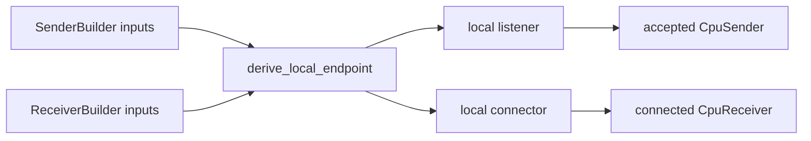

# Phase 3: Local Channel Runtime

**Status:** In Progress

## TL;DR

Implement Layer 2 for local communication with directional endpoints, payload-only frames, and separate metadata.
Transport selection remains internal, and receive materialization behavior is configured once on the receiver endpoint.
Phase 3 starts with a synchronous API, keeps raw interprocess handle types private behind channel internals, and
targets point-to-point local channels first.

## Scope

- Directional endpoint API for local scope (`Sender`, `Receiver`)
- Distinct builders (`SenderBuilder`, `ReceiverBuilder`)
- Synchronous send/receive API for the first implementation
- Point-to-point local channels only for the first implementation
- Trait-based channel allocator integration over concrete Layer-1 allocator backends
- Vulkan IPC transport (external memory handles + shared metadata)
- Local CPU shared-memory transport
- Two receive variants:
  - typed default: `recv::<M>() -> (Frame, M)`
  - dynamic map: `recv_map() -> (Frame, MessageMeta)`
- Receiver-owned allocation strategy (no per-recv target hints)
- Lightweight endpoint introspection (`scope()`, `receive_representation()`)
- Local-only tests and benchmarks

## Phase Ordering

Implementation should proceed in this order:

1. Local point-to-point CPU shared-memory transport implementation with internal listen/connect bootstrap.
2. Builder integration around deterministic local endpoint naming derived from `ChannelId`.
3. GPU allocator changes required for device-local, importable external-memory allocations.
4. Local point-to-point Vulkan IPC transport implementation.
5. True inter-process tests for CPU and GPU local IPC paths.
6. Local bootstrap hardening:
   - OS peer validation during connection establishment
   - optional shared-secret challenge/response before any handle transfer or message I/O

Rationale:

- CPU transport already has real handle export/import primitives and lower platform risk.
- Local transport bootstrap should be owned by the library rather than pushed to users.
- GPU transport has additional complexity beyond the control plane:
  - device-local/importable allocation requirements
  - Vulkan import path implementation
  - external synchronization follow-up
- Bootstrap authentication is valuable, but it should follow the basic point-to-point transport and
  real inter-process tests so the security layer is built on a stable rendezvous flow.
- Starting with CPU first reduces uncertainty while preserving the same channel API and transport envelope shape.

## Deliverables

- `ChannelBuilder::sender(...)` and `ChannelBuilder::receiver(...)` returning distinct builders
- `Sender` / `Receiver` endpoint types
- `ChannelAllocator` trait with fixed-target allocation-only implementations
- No `src/memory/unified.rs` planning; allocator composition stays in traits/builders and existing module boundaries
- Payload frame type (`Frame`) without embedded metadata
- Metadata contract (`ChannelMetadata` + `MessageMeta`) with mandatory `used_size`
- Receiver-level `ReceiveRepresentation` (`ExternalShare`, `Materialized`)
- Sender-side metadata serialization configuration (codec selection), propagated during connect
- `VulkanIpcTransport`
- Local shared-memory transport integration
- Internal local rendezvous model (`listen` / `accept` / `connect`) hidden behind builders
- Integration tests for local IPC paths
- Platform control-plane plan for real inter-process tests:
  - Unix: Unix-domain sockets with `SCM_RIGHTS` for fd transfer
  - Windows: named pipes for coordination plus native handle duplication/transfer for OS handles

## Local Bootstrap Boundary

Phase 3 local channels should use an internal bootstrap flow that is common in shape across Unix and
Windows:

- a deterministic local endpoint name is derived from `ChannelId`
- one side acts as transport server and performs `listen` / `accept`
- the other side acts as transport client and performs `connect`
- after connect, the sender performs per-message handle transfer as needed

Users should not manage socket paths, pipe names, or connection ordering directly.



### Builder Assumption

The builders do not need live peer process objects. They only need shared bootstrap identity that
both processes can know independently:

- `ChannelId`

That identity is sufficient to derive the same local rendezvous endpoint in both processes.

If the peer later creates its own sender for reverse application traffic, that reverse channel must
use a distinct `ChannelId`.

### Why This Matters On Windows

Windows shared-memory handle duplication only needs the receiver process once the local connection is
open. That is acceptable because the actual duplication happens at message-send time, not at
builder-construction time.

### Current Phase 3 Default

For local point-to-point transport bootstrap, the current default should be:

- `Sender` acts as transport server
- `Receiver` acts as transport client

That default keeps the bootstrap model compatible with a future local 1 -> many broadcast mode,
where one logical sender may accept multiple transport clients over time.

## Deferred Fan-Out

Multiple receivers for one sender are explicitly out of scope for Phase 3.

Future fan-out support should be introduced as a separate semantic mode, most likely local
broadcast/fan-out, with these runtime implications:

- one sender maintaining multiple connected local peers
- one handle transfer per receiver on each message
- immutable payload contract after `send`

Remote fan-out should remain compatible with the same semantic boundary:

- MPI can support one-to-many delivery through repeated point-to-point sends or collective
  communication such as broadcast
- the concrete MPI mapping should remain a transport/runtime choice rather than changing the public
  channel payload or metadata model

This expansion should reuse the same bootstrap model and public `Frame` / metadata API rather than
introducing a second payload abstraction.

## Deferred Bootstrap Authentication

Bootstrap authentication should be implemented as a later Phase 3 hardening step, not as part of
the initial local transport bring-up.

Recommended shape:

- perform OS-level peer validation during local connection establishment
  - Unix: peer credentials on connected Unix sockets
  - Windows: peer PID validation on connected named pipes
- optionally perform application-level mutual authentication using a shared secret
- run this authentication step before any handle transfer or channel message I/O

The preferred application-level mechanism is a nonce-based challenge/response using a shared secret,
so malicious same-user processes that do not know the secret can be rejected even if they can reach
the endpoint name.

## Encapsulation Boundary

`InterprocessMemoryHandle` should remain private in Phase 3 unless a concrete transport or interop integration cannot be
implemented cleanly without exposing it.

Preferred boundary:

- Layer 1 exposes stable allocators and buffers
- Layer 2 local transports perform handle export/import internally
- Public channel APIs expose `Frame`, metadata, and allocator configuration rather than raw OS handles

If later language interop work requires direct handle access, that should be introduced as a narrower public export/import
API rather than by exposing all transport internals by default.

## Deferred Follow-Up

- Async receiver loops and dispatch integration are explicitly deferred until the synchronous local runtime shape is
  validated in code.
- ADR-010 currently describes a non-blocking API that does not match the sync-first Phase 3 plan; reconcile that after the
  synchronous local runtime is proven out.
- Local fan-out / multi-receiver semantics are deferred until point-to-point local transport is stable.
- Bootstrap authentication is deferred until the basic point-to-point local runtime and true
  inter-process tests are stable.

## Example (API Shape)

```rust
let tx = ChannelBuilder::sender(my_loc.clone(), peer_loc.clone())
    .with_metadata_encoding(MetadataEncoding::Cbor)
    .build()?;

let rx = ChannelBuilder::receiver(my_loc, peer_loc)
    .with_allocator(cpu_allocator)
    .build()?;

let meta = ImageMeta {
    used_size: payload_bytes,
    width: 1920,
    height: 1080,
};

tx.send(payload_buffer, &meta)?;
let (frame, meta) = rx.recv::<ImageMeta>()?;
let used = meta.used_size();

let representation = rx.receive_representation();
```

## Related Docs

- [Channels Spec](../spec/channels.md)
- [Interop Overview](../spec/interop/README.md)
- [ADR-002 GPU API Selection](../adr/002-gpu-api-selection.md)
- [ADR-010 Channel Buffer Strategy](../adr/010-channel-buffer-strategy.md)

## External References

- [Vulkan External Memory](https://registry.khronos.org/vulkan/specs/latest/man/html/VK_KHR_external_memory.html)
- [Vulkan External Semaphore](https://registry.khronos.org/vulkan/specs/latest/man/html/VK_KHR_external_semaphore.html)
