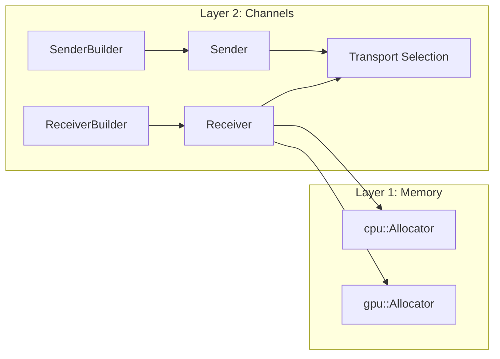

# lava-flow Architecture

## TL;DR

lava-flow uses a two-layer architecture:

- Layer 1 (`memory`): allocates and exports/imports CPU/GPU buffers.
- Layer 2 (`channels`): routes frames across local/remote transports and exposes directional endpoints.

Receive allocation is receiver-owned (configured on receiver construction), while sender paths remain allocation-policy
free.

## Layered Model



## Public API Direction

The channel API is symmetric on payload `Frame`, while metadata is exchanged as a separate value.

```rust
let tx = ChannelBuilder::sender(my_loc.clone(), peer_loc.clone())
    .with_metadata_encoding(MetadataEncoding::Cbor)
    .build()?;

let rx = ChannelBuilder::receiver(my_loc, peer_loc)
    .with_allocator(cpu_allocator)
    .build()?;

let meta = ImageMeta {
    used_size: payload_bytes,
    width: 1920,
    height: 1080,
};

tx.send(payload_buffer, &meta)?;
let (frame, meta) = rx.recv::<ImageMeta>()?;
let used = meta.used_size();
```

Key points:

- Sender side does not require an allocator.
- Sender side owns metadata encoding selection; local transports propagate it during connect.
- Receiver side owns materialization policy via its configured allocator.
- Endpoint introspection is lightweight: `scope()` and `receive_representation()`.
- `recv::<M>()` is the default typed path returning `Frame`; `recv_map()` is the dynamic fallback.
- Metadata always carries `used_size` for payload validity.
- Current local transports use a versioned tagged binary control protocol with receiver import
  acknowledgment before `send()` completes.

## Transport Routing

Transport choice is derived from communication scope and payload characteristics.

```rust
fn select_transport(scope: CommunicationScope, frame: &Frame) -> TransportKind {
    match (scope, frame_is_gpu(frame)) {
        (CommunicationScope::Local, true) => TransportKind::VulkanIpc,
        (CommunicationScope::Local, false) => TransportKind::CpuSharedMemory,
        (CommunicationScope::Remote, _) => TransportKind::MpiPointToPoint,
    }
}
```

## Receive Behavior

Receiver properties are fixed at construction and queried via `receive_representation()`.

Receive variants:

- typed: `recv::<M>() -> (Frame, M)`
- dynamic: `recv_map() -> (Frame, MessageMeta)`

In both cases metadata defines the valid payload region through `used_size`.

## Allocation Policy Contract

Layer-2 channel allocators are fixed-target by default:

- `cpu::Allocator` delivers CPU-backed payload buffers
- `gpu::Allocator` delivers GPU-backed payload buffers

Composite/hybrid allocators may exist, but the base contract avoids mandatory dual CPU/GPU branching in every allocator
implementation.

## Implementation Conventions

- For non-trivial OS-specific logic, split files by platform:
  - shared API/orchestration in `mod.rs`
  - Unix logic in `unix.rs`
  - Windows logic in `windows.rs`
- Prioritize decisions as:
  1. security and correctness
  2. API stability
  3. coverage completeness
- Keep test-only fault injection out of production runtime branches.

## Current Local Security

Current local transport hardening is platform-specific:

- Windows named pipes are created with an explicit current-logon-session DACL rather than the
  default descriptor, and the current implementation uses one duplex pipe per local channel.
- Unix-domain sockets live under a private per-user runtime directory, not directly under `/tmp`.

This is the current baseline before later peer validation and shared-secret challenge/response are
added on top.

## Related Docs

- [Memory Spec](memory.md)
- [Channel Semantics](channels.md)
- [Design Rationale](../plan/design_rationale.md)
- [Phase 3](../plan/phase_3.md)
- [Phase 4](../plan/phase_4.md)
- [Phase 5](../plan/phase_5.md)
- [ADR Index](../adr/README.md)
