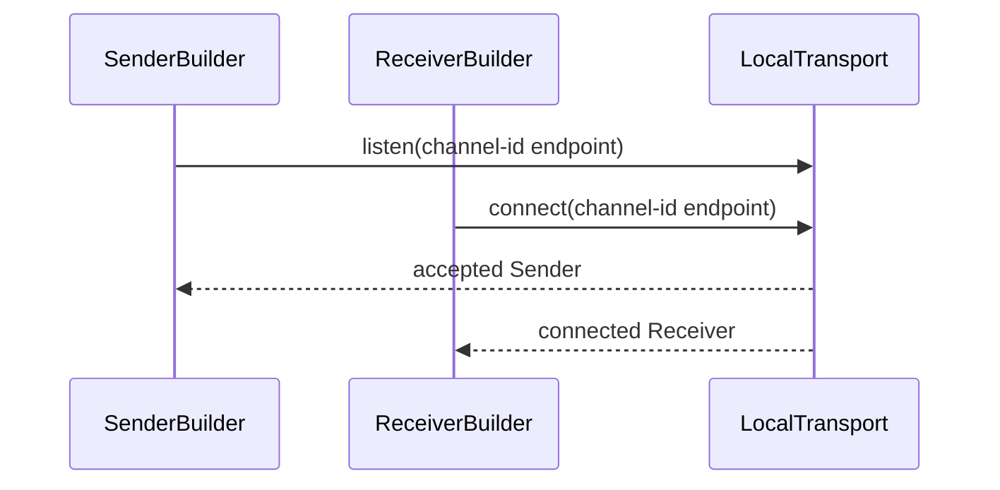

# Layer 2: Channel Semantics

This document defines the channel API and transport behavior for local and remote communication.

## TL;DR

- Distinct builders are used: `SenderBuilder` and `ReceiverBuilder`.
- Distinct endpoints are used: `Sender` and `Receiver`.
- `Frame` carries payload only; metadata is separate.
- Phase 3 local channels are point-to-point.
- Receiver allocation policy is configured once at channel creation (default CPU).
- Channel allocators are fixed-target (`CPU` or `GPU`) and allocation-only.
- Receiver introspection is lightweight and stable: `scope()` and `receive_representation()`.
- Two receive variants are provided:
  - typed default: `recv::<M>() -> (Frame, M)`
  - dynamic map: `recv_map() -> (Frame, MessageMeta)`

## API Shape

```rust
let channel_id = ChannelId::new("image-stream")?;

// Sender process.
let mut tx = Builder::sender(channel_id.clone(), my_loc.clone(), peer_loc.clone())
    .with_metadata_encoding(MetadataEncoding::Json)
    .build()?;


let meta = ImageMeta {
    width: 1920,
    height: 1080,
    valid_bytes: payload_bytes,
};

tx.send(payload_buffer, &meta)?;
```

```rust
let channel_id = ChannelId::new("image-stream")?;

// Receiver process.
let mut rx = Builder::receiver(channel_id, my_loc, peer_loc).build()?;

let (frame, meta) = rx.recv::<ImageMeta>()?;
let valid_bytes = meta.valid_bytes;

// Dynamic fallback variant
let (frame, map_meta) = rx.recv_map()?;
let valid_bytes = map_meta.values.get("valid_bytes");
```

Convenience constructors for the common local-scope case, still used from separate peers.

```rust
let local_tx = Builder::local_sender(ChannelId::new("frames")?)?.build()?;
```

```rust
let local_tx_with_timeout = Builder::local_sender(ChannelId::new("frames")?)?
    .build_with_timeout(std::time::Duration::from_secs(2))?;
```

```rust
let local_rx = Builder::local_receiver(ChannelId::new("frames")?)?.build()?;
```

```rust
let local_rx_with_timeout = Builder::local_receiver(ChannelId::new("frames")?)?
    .build_with_timeout(std::time::Duration::from_secs(2))?;
```

### Why Distinct Builders

Distinct builders avoid typestate complexity while preserving normal builder ergonomics:

- sender options stay sender-specific
- receiver options stay receiver-specific
- modifier ordering remains natural
- `build()` return type is always unambiguous
- both sides receive the shared `ChannelId` needed for deterministic local rendezvous naming

## Endpoint and Payload Model

```rust
pub enum Frame {
    Cpu(cpu::MemoryBuffer),
    Gpu(gpu::MemoryBuffer),
}

pub trait Metadata: Serialize + DeserializeOwned {}

pub enum ReceiveRepresentation {
    ExternalShare,
    Materialized,
}

impl Sender {
    pub fn send<M, F>(&mut self, frame: F, metadata: &M) -> Result<()>
    where
        M: Metadata,
        F: Into<Frame>;
    pub fn send_map<F>(&mut self, frame: F, metadata: MessageMeta) -> Result<()>
    where
        F: Into<Frame>;
    pub fn scope(&self) -> CommunicationScope;
}

impl Receiver {
    pub fn recv<M: Metadata>(&mut self) -> Result<(Frame, M)>;
    pub fn recv_map(&mut self) -> Result<(Frame, MessageMeta)>;
    pub fn scope(&self) -> CommunicationScope;
    pub fn receive_representation(&self) -> ReceiveRepresentation;
}
```

Rationale:

- `Frame` stays non-generic and focused on payload backend kind.
- Metadata concerns stay separate from payload concerns.
- `send` and `send_map` can stay ergonomic by accepting any `Into<Frame>` input, so callers can
  pass `cpu::MemoryBuffer`, `gpu::MemoryBuffer`, or an already constructed `Frame`.
- Typed metadata (`recv::<M>()`) is the common ergonomic path.
- Dynamic metadata (`recv_map()`) remains available for schema-less workflows.

## Local Bootstrap Model

Phase 3 local IPC should use an internal listen/connect handshake similar to client/server
transport setup, but that transport detail stays behind the channel builders.

The public builder model is designed for separate peer processes, not for constructing sender and
receiver endpoints one after the other in a single thread. In the current local implementation,
sender `build()` binds the rendezvous endpoint and waits for the receiver process to connect before
returning a `Sender`; receiver `build()` connects to an already-listening sender. Receivers that may
start before the sender should use `build_with_timeout(...)`. Supervisors that need to bound or
cancel endpoint construction can use `build_with_timeout(...)`, `build_or_cancelled(...)`, or
`build_with_timeout_or_cancel(...)` on the blocking builder.

Public intent:

- users provide a shared logical channel identifier
- the library derives the local rendezvous endpoint from that channel id and the selected local
  access policy
- one side acts as transport server and performs `listen` / `accept`
- the other side acts as transport client and performs `connect`
- both peers must choose the same local access policy; mixed policies intentionally use different
  rendezvous endpoints and do not connect
- sender-configured metadata encoding is communicated during connection bootstrap
- after connection, message flow stays normal `send` / `recv`
- local transports use a small versioned binary protocol rather than serializing Rust structs

Users should not be required to implement their own pipe/socket bootstrap logic to use local
channels.

If a peer later creates its own sender for reverse application traffic, that reverse channel must
use a distinct `ChannelId`.



### Bootstrap Role vs Message Direction

Bootstrap role should stay separate from message direction:

- `Sender` / `Receiver` describe payload flow
- transport server/client describe endpoint establishment
- `listen` / `accept` / `connect` belong to transport internals

The transport server does not need to always be the channel receiver in the abstract API. The
current Phase 3 default is sender-listen, receiver-connect because that keeps the path open for
future 1 -> many local broadcast without changing the rendezvous model, but that should remain an
implementation choice rather than a public API rule.

## Current Local Protocol

Phase 3 local IPC currently uses a tagged binary control protocol.

Connection bootstrap:

- sender accepts the transport connection
- sender writes a connection header:
  - protocol tag
  - protocol version
  - metadata encoding
- receiver validates the version before normal message I/O begins

Per-message flow:

- sender writes a message-envelope tag
- sender writes the payload backend kind tag derived from the transferred handle
- sender writes payload size
- for GPU payloads, sender writes the logical GPU device id used for receive-side import
- sender transfers the shared-memory handle
- sender writes serialized metadata bytes
- receiver imports the handle and then sends either:
  - `ImportOk`
  - `ImportFailed`

This means `send()` is synchronous at the protocol level: it completes only after the receiver has
either accepted the imported handle or rejected it.

Current builder surface:

- `Builder::sender(channel_id, my_location, peer_location)`
- `Builder::receiver(channel_id, my_location, peer_location)`
- `Builder::local_sender(channel_id)` / `Builder::local_receiver(channel_id)` for the common
  same-host case using `ProcessLocation::from_hostname()`
- local sender `build()` is a blocking accept step and returns only after the receiver peer connects
- sender builder currently exposes:
  - metadata encoding
  - local access convenience methods:
    - `with_current_session_local_access()` for the default current logon session / Unix user policy
    - `with_authenticated_users_local_access()` for explicitly shared local IPC between local users
  - local maximum payload size
  - local maximum metadata size
  - optional `build_with_timeout(timeout)` for bounded waits while accepting a receiver
  - optional cancellation via `BuildCancel`, `build_or_cancelled(...)`, and
    `build_with_timeout_or_cancel(...)`
- receiver builder currently exposes:
  - the same local access convenience methods as the sender builder
  - local maximum payload size
  - local maximum metadata size
  - optional `build_with_timeout(timeout)` for startup-tolerant local connects
  - optional cancellation via `BuildCancel`, `build_or_cancelled(...)`, and
    `build_with_timeout_or_cancel(...)`
- current public builder implementation realizes only local scope; remote build paths fail
  explicitly until the remote transport layer is added

Local envelope size limits:

- local transports enforce explicit payload-size and metadata-size limits on both send and receive
- oversized envelopes are rejected before metadata allocation or shared-memory import
- the current defaults are:
  - payload: `1 GiB`
  - metadata: `1 MiB`
- the local sender/listener and receiver are constructed with those limits explicitly

## Current Local Security

Phase 3 local security is transport-specific and currently implemented as follows.

Windows:

- local IPC uses one duplex named pipe for bootstrap, envelopes, CPU/GPU handle transfer, and
  import ACK/NACK traffic
- the named pipe is created with an explicit DACL rather than the Windows default
- the default current-session local access policy grants access to the current logon session only
- the authenticated-users local access policy grants access to the Windows Authenticated Users SID;
  it does not use the broader Everyone SID
- the granted access mask is aligned with the actual duplex client open mode used by the transport

Unix:

- local IPC uses Unix-domain sockets with `SCM_RIGHTS` for CPU/GPU fd transfer
- the default current-session local access policy derives the socket path under a private per-user
  runtime directory
- `LAVA_FLOW_RUNTIME_DIR` is preferred as an explicit override for orchestrated/container setups
- otherwise `XDG_RUNTIME_DIR/lava-flow/` is used when available
- if `XDG_RUNTIME_DIR` is unset, `/run/user/<uid>/lava-flow/` is used when that runtime base exists
- otherwise the fallback is `$HOME/.local/run/lava-flow/`
- the runtime directory is created with `0700` (`rwx------`) permissions before bind; `0600` is not
  sufficient for a directory because execute/search permission is required to traverse it and create
  or remove the socket entry
- the runtime directory must not be a symlink and must be owned by the effective user
- the authenticated-users local access policy uses a socket path directly under the system
  temporary directory and sets the socket mode to `0666` (`rw-rw-rw-`); the parent directory must be
  sticky and writable by other users

These measures reduce cross-user access to local IPC endpoints before the later shared-secret
challenge/response hardening is added.

### Point-To-Point First

Phase 3 commits only to point-to-point local channels:

- one sender
- one receiver
- ordered delivery per channel

Future fan-out support should be added as a separate semantic mode rather than overloading the
point-to-point channel contract.

### Future Fan-Out Boundary

The local transport should still be implemented so that future fan-out is possible without changing
the public payload API.

Future broadcast-capable local transport would require:

- one logical sender with multiple connected transport peers
- one per-peer handle transfer on each message
- immutable payload-by-contract after `send`

This is especially important for local CPU shared-memory transport:

- Windows would duplicate the shared-memory handle once per connected receiver process
- Unix would send one fd per connected receiver via `SCM_RIGHTS`

Remote fan-out can follow the same semantic split later:

- MPI can support 1 -> many delivery either through one-to-many point-to-point fan-out or collective
  communication such as broadcast
- which MPI mechanism is chosen should remain a transport/runtime decision behind the same higher-level
  channel mode

That is a transport/runtime expansion, not a change to `Frame`, metadata, or typed receive APIs.

### Payload Representation

`Frame` is the public payload type and distinguishes payload backend kind:

- `Frame::Cpu` for CPU-backed payloads
- `Frame::Gpu` for Vulkan-backed GPU payloads

It does not expose whether the receiver got the payload by importing shared backing or by
materializing a local buffer.

Representation is reported through receiver introspection rather than a separate payload enum:

- `ReceiveRepresentation::ExternalShare` means the receiver imported or shared transport backing
- `ReceiveRepresentation::Materialized` means the receiver received a local materialized buffer

Expected consequence:

- local CPU zero-copy receive may still return `Frame::Cpu` while
  `receive_representation()` reports `ExternalShare`
- a materializing receive path may also return `Frame::Cpu`, but
  `receive_representation()` reports `Materialized`

## Channel Allocator Model

Receiver materialization is channel-owned and configured once at receiver creation.

```rust
pub trait ChannelAllocator: Send + Sync {
    /// Fixed output target for materialized payloads.
    fn delivery_target(&self) -> MemoryLocation;
    /// Allocate destination memory using the allocator's fixed-target strategy.
    fn allocate(&self, size: usize) -> Result<Frame>;
}
```

Expected implementations:

- `cpu::Allocator` (CPU target)
- `gpu::Allocator` (GPU target)
- Optional composite wrappers if needed (e.g. in Cuda-adapter).

Notes:

- `local_receive_mode` is not part of allocator API.
- Local receive behavior is channel runtime policy; allocator is used when materialization is needed.
- Memory strategy details (ring/arena/hybrid/pinned) stay allocator-internal.

## Transport Selection (Internal)

- **Local + GPU payload:** Vulkan IPC (external memory handles)
- **Local + CPU payload:** shared memory
- **Remote:** MPI point-to-point (including direct-transfer capable paths where available)

```rust
fn select_transport(scope: CommunicationScope, frame: &Frame) -> TransportKind {
    match (scope, frame_is_gpu(frame)) {
        (CommunicationScope::Local, true) => TransportKind::VulkanIpc,
        (CommunicationScope::Local, false) => TransportKind::CpuSharedMemory,
        (CommunicationScope::Remote, _) => TransportKind::MpiPointToPoint,
    }
}
```

For local point-to-point transport bootstrap, the runtime should derive a deterministic endpoint
name from `ChannelId` rather than requiring users to exchange raw platform addresses.

## Why No `recv_into` In Core API

- `recv_into` couples channel API to concrete buffer ownership details.
- Conflicts with intra-node non-materialization policy (might require unnecessary alloc)
- Ring/arena/hybrid reuse belongs in allocator strategy and can be implemented without expanding channel API.
- Interop integrations (Torch/NumPy/etc.) should not force transport representation into the
  core channel payload type.

## Metadata Envelope

```rust
pub type MetadataMap = std::collections::BTreeMap<String, MetaValue>;

pub enum MetaValue {
    Bool(bool),
    I64(i64),
    U64(u64),
    F64(f64),
    String(String),
    Bytes(Vec<u8>),
    List(Vec<MetaValue>),
    Map(MetadataMap),
}

pub struct MessageMeta {
    pub values: MetadataMap,
}
```

Typed metadata remains serde-driven:

- send typed: `M: Metadata`
- receive typed: `M: Metadata`
- receive dynamic: `MessageMeta` via `recv_map()`

Metadata contract:

- Metadata is mandatory for every message.
- Buffer size is carried by the transport frame header and is used for handle import.
- Applications may include valid-byte counts or other payload interpretation fields in metadata
  when needed.

## Semantics (All Transports)

- **Ordering:** producer order is preserved per channel
- **Ownership:** sender must not mutate in-flight payloads
- **Backpressure:** bounded queues or transport-level flow control
- **Errors:** surfaced via unified `Result<T, Error>`
- **Observability:** receiver properties via `scope()` / `receive_representation()` /
  receiver-level representation introspection
- **Synchronization:** in Phase 5+, channel manages external semaphore wait/signal internally

## Related Docs

- [Architecture](architecture.md)
- [Memory Spec](memory.md)
- [Interop Overview](interop/README.md)
- [Phase 3](../plan/phase_3.md)
- [Phase 4](../plan/phase_4.md)
- [ADR-012 Serde Serialization](../adr/012-serde-serialization.md)

## External References

- [MPI Standard](https://www.mpi-forum.org/docs/)
- [OpenMPI Documentation](https://www.open-mpi.org/doc/)
- [Vulkan External Memory](https://registry.khronos.org/vulkan/specs/latest/man/html/VK_KHR_external_memory.html)
