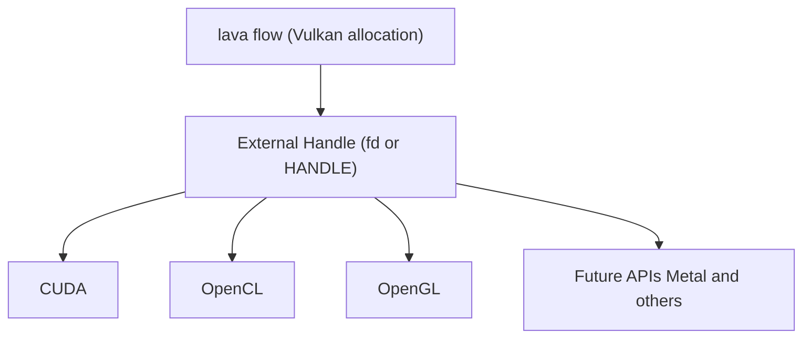

# Cross-API Interoperability Guide

## TL;DR

lava-flow allocates GPU memory via Vulkan, then exposes an external handle so CUDA, OpenCL, or OpenGL can import the
same allocation without copying. The detailed requirements and edge cases live in the upstream docs.

---

## Overview

**Architecture:**



---

## Supported APIs

| API | Status | Import Entry Point | Docs |
| --- | ------ | ------------------ | ---- |
| **CUDA** | Full | `cudaImportExternalMemory()` | [cuda_interop.md](cuda_interop.md) |
| **OpenCL** | Full | `clCreateBufferWithProperties()` | [opencl_interop.md](opencl_interop.md) |
| **OpenGL** | Full | `glImportMemoryFdEXT()` | [opengl_interop.md](opengl_interop.md) |
| **Vulkan Compute** | Native | N/A (already Vulkan) | *Built-in* |
| **Metal** | Phase 5+ | `MTLTexture(iosurface:)` | *Future* |
| **Direct3D 12** | Phase 5+ | `CreatePlacedResource()` | *Future* |

---

## Minimal Workflow (Example-Only)

### 1. Allocate with lava-flow (Rust, illustrative)

```rust
use lava_flow::gpu;

let mut allocator = gpu::Allocator::new_for_device(0)?;
let buffer = allocator.allocate(1_000_000)?; // 1 MB
// Transport/interoperability layers export the platform external handle.
```

### 2. Import in a target API (Linux examples)

**CUDA:**

```cpp
cudaExternalMemoryHandleDesc desc = {};
desc.type = cudaExternalMemoryHandleTypeOpaqueFd;
desc.handle.fd = vulkan_fd;
desc.size = 1000000;

cudaExternalMemory_t ext_mem;
cudaImportExternalMemory(&ext_mem, &desc);
```

**OpenCL:**

```c
cl_mem_properties props[] = {
    CL_EXTERNAL_MEMORY_HANDLE_OPAQUE_FD_KHR, (cl_mem_properties)vulkan_fd,
    0
};

cl_mem buffer = clCreateBufferWithProperties(
    context, props, CL_MEM_READ_WRITE, 1000000, NULL, &err
);
```

**OpenGL:**

```c
GLuint mem_obj;
glCreateMemoryObjectsEXT(1, &mem_obj);
glImportMemoryFdEXT(mem_obj, 1000000, GL_HANDLE_TYPE_OPAQUE_FD_EXT, vulkan_fd);
```

---

## External References

- [CUDA external memory](https://docs.nvidia.com/cuda/cuda-runtime-api/group__CUDART__EXTRES__INTEROP.html)
- [OpenCL external memory](https://registry.khronos.org/OpenCL/specs/3.0-unified/html/OpenCL_Ext.html#cl_khr_external_memory)
- [OpenGL memory object](https://registry.khronos.org/OpenGL/extensions/EXT/EXT_external_objects.txt)
- [Vulkan external memory](https://registry.khronos.org/vulkan/specs/latest/man/html/VK_KHR_external_memory.html)

---

## lava-flow Architecture Notes

- [ADR-002: GPU API Selection](../../adr/002-gpu-api-selection.md)
- [ADR-003: External Memory Handle Types](../../adr/003-external-memory-handle-types.md)
- [Design Rationale](../../plan/design_rationale.md)

---

**See individual API guides for small examples and doc links.**
